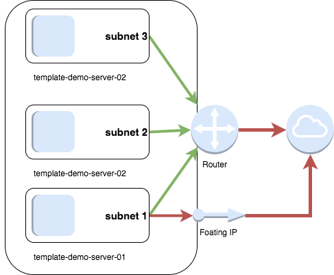

## Terraform Templating Example

This demo uses [Terraform's][terraform] variables and loop structures to create [UKCloud for OpenStack][ukcloud] infrastructure with a flexible configuration.



The default configuration will result in a network comprised of:

* 1 Network
* 3 Subnets: 172.16.[1-3].0/24
* 3 Cloud Instances: template-demo-server-[01-03]
* Security groups allowing ports 22, 80, 443, 8443
* A floating IP assigned to the first server

The number of Subnets and Instances can be configured by editing the file `vars.tf`. Changing the value of `num_nets` will affect the number of instances, networks, and subnetworks created.

Changing the list of allowed ports will affect the security group settings of all instances.

### Demo Requirements

To run this demo, you'll need the following:

* [Terraform][terraform]

* OpenStack Credentials: These can be obtained through the UKCloud for OpenStack Dashboard.  Terraform supports the [clouds.yaml][cloudsyaml] file, and this is the recommended way to manage OpenStack credentials.  See [clouds.yaml.sample](clouds.yaml.sample) as an example.

* An SSH keypair in your OpenStack portal.  This is configured in `vars.tf`

### Running the demo

After making sure your credentials are in place, check the variable `cloud_name` in `vars.tf` to make sure that it is set to `demo-cor` for Corsham or `demo-frn` for Farnborough instances.

When this is finished, run:

```bash

terraform plan

```

This should show a list of resources to be created.

```bash

terraform apply

```
This will create the infrastructure, or apply changes you have made to the configuration.

[terraform]:http://terraform.io/
[ukcloud]:https://ukcloud.com/openstack
[cloudsyaml]:https://docs.openstack.org/python-openstackclient/pike/configuration/index.html
